<p align="center">
  
</p>

<h1 align="center">5M16S</h1>

<p align="center">
  <a href="https://github.com/yourusername/5M16S">
    
  </a>
  <a href="https://github.com/yourusername/5M16S">
    
  </a>
  
  
</p>

<p align="center"><i>
An end-to-end pipeline for 16S rRNA gene amplicon analysis — from raw SRA accessions to DADA2 ASV tables, with reproducible scripts, references, and troubleshooting.
</i></p>

> [!WARNING]
> 🚧 Project under active development — features and docs may change.

---

## 📑 Table of Contents
<details>
<summary><b>Expand / Collapse</b></summary>


- [Key Challenges](#key-challenges)
- [Software Requirements](#software-requirements)
- [Scripts](#scripts)
- [Reference Data](#reference-data)
- [Workflow](#workflow)
  - [Step 0. Global 16S rRNA gene SRA metadata](#00-obtain-global-16s-sra-candidates)
  - [Step 1: Data cleaning](#step-1-select-sra-records-by-bioproject)
  - [Step 2: Downloading](#step-2-download-with-prefetch)
  - [Step 3: Converting SRA → FASTQ](#step-3-convert-sra--fastq)
  - [Step 4: Organize FASTQs by BioProject, Layout & Platform
](#step-4-arrange-fastq-by-bioproject)
  - [Step 5: dada2 Analysis by BioProject Directory
](#step-5-run-dada2-per-bioproject)
  - [Step 6: 16S rRNA gene sequencing Region Identification
](#step-5-run-dada2-per-bioproject)
  - [Step 7: Merging by 16S rRNA gene regions
](#step-5-run-dada2-per-bioproject)
  - [Step 8: Removing non-16S rRNA gene features
](#step-5-run-dada2-per-bioproject)
  - [Step 9: Checking sequencing saturation & Removing Unsaturated Data
](#step-5-run-dada2-per-bioproject)
  - [Step 10: Ontology assignments
](#step-5-run-dada2-per-bioproject)
  - [Step 11: Ontology assignments
](#step-5-run-dada2-per-bioproject)
  - [Step 12: Mapping Geographic Coordinates
](#step-5-run-dada2-per-bioproject)


- [Common Pitfalls](#common-pitfalls)
- [Troubleshooting](#troubleshooting)
- [Notes](#notes)

</details>

---

## 🚧 Key Challenges
1. **Comprehensive Retrieval** – Capturing all available 16S amplicon datasets.
2. **Platform Diversity** – Handling Roche 454 | Illumina | Ion Torrent | PacBio.
3. **Primer Strategy** – Whether, when, and how to trim primers.
4. **Target Regions** – Managing different 16S variable regions.
5. **Ecology/Metadata** – Heterogeneous ecological metadata.
6. **Quality Thresholds** – Consistent, defensible QC criteria.

---

## 🛠 Software Requirements

| Software  | Version  | Purpose |
|-----------|----------|---------|
|  | 3.1.1 | Retrieve and split SRA data into FASTQ |
|  | 0.24.0 | FASTQ quality control and filtering |
|  | 5.1 | Primer detection and trimming |
|  | ≥3.9 | Run Python utilities |
|  | 4.4.3 | Run R-based analysis |
|  | 2.10.0 | FASTQ statistics |
|  | 0.6.1 | Parallel execution |
|  | 0.33.0 | Table filtering and manipulation |


| Package | Version | Purpose |
|---------|---------|---------|
|  | 1.34.0 | Amplicon sequence variant inference |
|   | — | Command-line argument parsing |

---
## Scripts

| Script                      | Required | Language | Status      | Purpose |
|----------------------------|:--------:|:--------:|------------|---------|
| `amplicon_reads_lost_check.sh` | ✅ | Shell    | Stable     | Check the **ratio of reads lost after merging**; reports samples with low merged/non-chimera retention. |
| `dada2.R`                  | ✅       | R        | Stable     | **Wrapper for DADA2** to infer ASVs and produce QC summaries. |
| `dd2_pipeline.sh`          | ✅       | Shell    | Stable     | **Main pipeline driver**: orchestrates `seqkit → fastp → cutadapt → DADA2` (PE/SE). |
| `fastq_dispatcher.py`             | ✅       | Python   | Stable     | **Arrange downloaded FASTQ files by metadata** (e.g., BioProject, platform, PE/SE) into `PROJECT/00_fq/`. |
| `is_16s_amplicon.py`       | —        | Python   | Stable     | **Verify whether data were generated from 16S rRNA amplicon sequencing** (e.g., via reference hits). |
| `merge_seqtab_nochim_rds.R`| —        | R        | Developing | **Merge DADA2 `seqtab_nochim` RDS files** across runs/projects. |
| `ontology_infer.py`        | —        | Python   | Developing | **Ontology inference** utilities for downstream metadata/label prediction. |
| `ontology_train_cv.py`     | —        | Python   | Developing | **Ontology training & cross-validation** helpers. |
| `split_fq12.sh`            | —        | Shell    | Stable     | **Split concatenated paired-end reads** into `_1` and `_2` files. |
| `summarize_cutadapt.py`    | ✅       | Python   | Stable     | **Summarize cutadapt results** (primer detection/trim statistics). |
| `unify_fq_suffix.py`       | —        | Python   | Stable     | **Normalize FASTQ filenames**, especially for non-NCBI data sources. |

> **Note:** Ensure all scripts marked **✅ Required** are **installed and executable** before running the pipeline.

## Init setup

```bash
gh repo clone ypchan/5M16S # not public
cd 5M16S
bash setup.sh
```
<p align="center">
  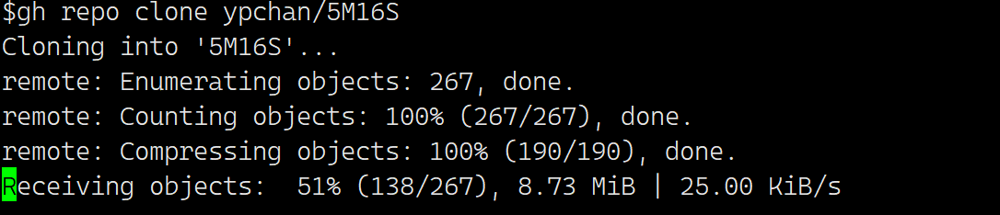
</p>

```bash
# download id manually, unzip it
unzip 5M16S-main.zip
mv 5M16S-main 5M16S && rm 5M16S-main.zip
cd 5M16S
bash setup.sh
```
<p align="center">
  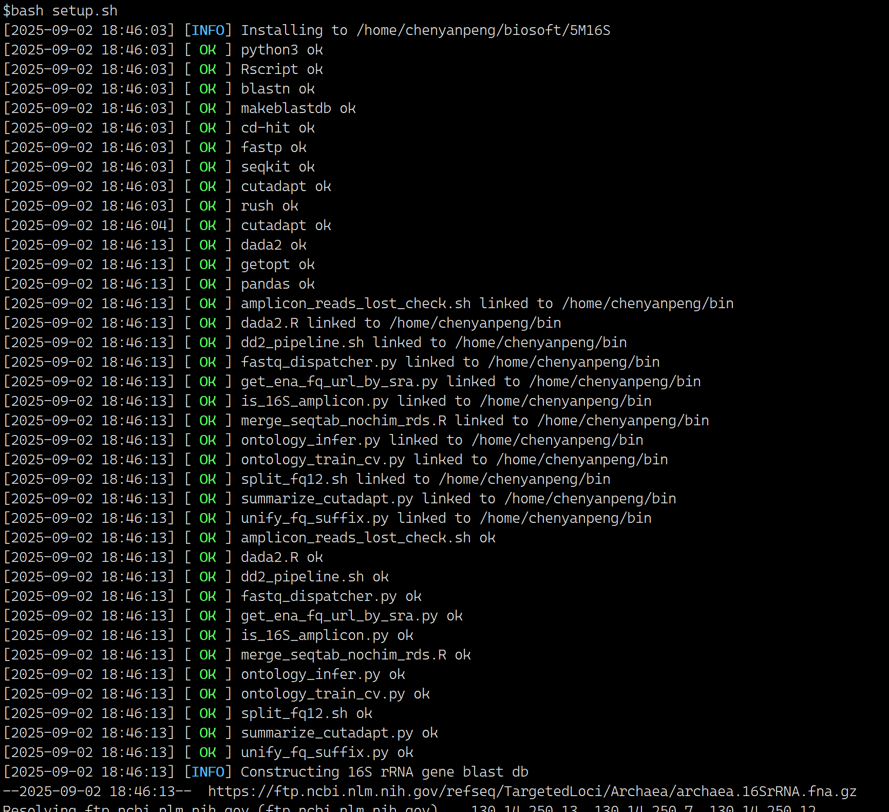
</p>

## Data

### 16S rRNA gene Blast DB
Build a 16S rRNA reference database for verifying FASTQ content (optional but recommended).

```bash
# Download archaeal & bacterial 16S rRNA reference sequences
wget -c https://ftp.ncbi.nlm.nih.gov/refseq/TargetedLoci/Archaea/archaea.16SrRNA.fna.gz
wget -c https://ftp.ncbi.nlm.nih.gov/refseq/TargetedLoci/Bacteria/bacteria.16SrRNA.fna.gz
gunzip *.gz

# Example: normalize headers and build BLAST DB
cat archaea.16SrRNA.fna | awk '{print $1}' | sed 's/>/>archaea__/' > arch_bac_nr_16s_ref.fna
makeblastdb -in arch_bac_nr_16s_ref.fna -input_type fasta -db_type nucl -out arch_bac_nr_16s_ref
```

---

## Workflow

### 00. Obtain Global 16S SRA Candidates
Fetch metadata snapshots and derive a working set of public, live RUN accessions likely to be amplicons.

```bash
# All accessions (master table)
wget -c https://ftp.ncbi.nlm.nih.gov/sra/reports/Metadata/SRA_Accessions.tab

# Full metadata (one submission per folder)
wget -c https://ftp.ncbi.nlm.nih.gov/sra/reports/Metadata/NCBI_SRA_Metadata_Full_20250619.tar.gz

tar -zxvf NCBI_SRA_Metadata_Full_20250619.tar.gz

# Keep public, live RUN entries with a BioProject
head -n 1 SRA_Accessions.tab > SRA_Accessions.tab.live.run.public
sed '1d' SRA_Accessions.tab | awk -F '\t' '$3 ~ "live" && $7 ~ "RUN" && $19 !~ "-" && $9 ~ "public" {print}' >> SRA_Accessions.tab.live.run.public

# One submission may contain multiple runs/experiments; not all XMLs may exist
cat SRA_Accessions.tab.live.run.public | awk '{print $2}' | sed '1d' | sort -u > SRA_Accessions.tab.live.run.public.submission_acc.uniq

# Extract experiment info from XMLs
python3 extract_experiment_info.py -o submission.accession.unique.experiment.tsv -t 24 NCBI_SRA_Metadata_Full_20250619

# Merge tables in R
Rscript merge_table.R SRA_Accessions.tab.live.run.public submission.accession.unique.experiment.tsv SRA_Accessions.tab.live.run.public.add_experiment 24

# Keep likely amplicon libraries (strategy/source)
cat SRA_Accessions.tab.live.run.public.add_experiment | \
  csvtk -t filter2 -j 8 -f '$lib_strategy == "AMPLICON" && ($lib_source == "METAGENOMIC" || $lib_source == "GENOMIC" || $lib_source == "OTHER")' \
  > SRA_Accessions.tab.live.run.public.add_experiment.amplicon

# Heuristic filter to keep 16S (allow mismatches/missing)
head -n 1 SRA_Accessions.tab.live.run.public.add_experiment.amplicon.metagenomics > SRA_Accessions.tab.live.run.public.add_experiment.amplicon.metagenomics.16s

cat non_16s_keywords.list | grep -f - SRA_Accessions.tab.live.run.public.add_experiment.amplicon.metagenomics > SRA_Accessions.tab.live.run.public.add_experiment.amplicon.metagenomics.non16s

cat non_16s_keywords.list | grep -v -f - SRA_Accessions.tab.live.run.public.add_experiment.amplicon.metagenomics >> SRA_Accessions.tab.live.run.public.add_experiment.amplicon.metagenomics.16s

# recover possible 16S
grep -i '16s' SRA_Accessions.tab.live.run.public.add_experiment.amplicon.metagenomics.non16s >> SRA_Accessions.tab.live.run.public.add_experiment.amplicon.metagenomics.16s
```

`SRA_Accessions.tab.live.run.public.add_experiment.amplicon.metagenomics.16s` *(mismatches/missing possible)*

### Batching Strategy
> For large projects, split into batches to improve throughput and resilience.

```
02_batch.bioproject.list   # BioProject accessions, one per line
```

### Step 1: Select SRA Records by BioProject
*Treat the 16S candidate table as the lake; BioProject accessions are your baits.*

```bash
# Using csvtk
csvtk grep -t -f BioProject --pattern-file 02_batch.bioproject.list \
  SRA_Accessions.tab.live.run.public.add_experiment.amplicon.metagenomics.16s \
  > 02_batch.SRA_Accessions.tab.live.run.public.add_experiment.amplicon.metagenomics.16s

# Or use grep
head -n 1 SRA_Accessions.tab.live.run.public.add_experiment.amplicon.metagenomics \
  > 02_batch.bioplicon.metagenomics  # redirect header line 

cat 02_batch.bioproject.list | grep -F -w -f - \
  SRA_Accessions.tab.live.run.public.add_experiment.amplicon.metagenomics.16s \
  >> 02_batch.SRA_Accessions.tab.live.run.public.add_experiment.amplicon.metagenomics.16s
```

**Tip:** adding more specific filters to exclude non‑16S records.

### Step 2: Downloading with prefetch
*Adjust concurrency based on your network. Too many threads can waste CPU; too few underuse bandwidth.*

```bash
# If an amplicon run is >1 GB, double‑check its identity — often not true amplicon data.
# $2 = SRA run accession
cat 02_batch.SRA_Accessions.tab.live.run.public.add_experiment.amplicon.metagenomics.16s \
  | awk -F '\t' '{print $2}' \
  | rush -j 24 --continue --eta --succ-cmd-file rush_prefetch.finished \
      'prefetch {1} -O sra &> /dev/null'

# if downloading was interrupted, continue, removed the locked accessions
find sra -maxdepth 2 -name "*.sra.lock" -type f -exec dirname {} \; | xargs -n1 -I {} rm -rf {}

# and continue again, rush will check the finished file: rush_prefetch.finished, and skip finished ones
cat 02_batch.SRA_Accessions.tab.live.run.public.add_experiment.amplicon.metagenomics.16s \
  | awk -F '\t' '{print $2}' \
  | rush -j 24 --continue --eta --succ-cmd-file rush_prefetch.finished \
      'prefetch {1} -O sra &> /dev/null'

# -- or
ls sra | grep -w -v -F -f - 02_batch.SRA_Accessions.tab.live.run.public.add_experiment.amplicon.metagenomics.16s | awk -F '\t' '{print $2}' \
  | rush -j 24 --eta \
      'prefetch {1} -O sra &> /dev/null'
```
**Locked sra** stop downloading
<p align="center">
  
</p>

**downloading using prefetch**

<p align="center">
  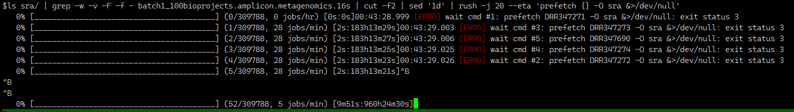
</p>


### Step 3: Convert SRA → FASTQ

```bash
mkdir -p fq
# Split and delete SRA to save space
awk -F '\t' 'NR>1{print $2}' 02_batch.SRA_Accessions.tab.live.run.public.add_experiment.amplicon.metagenomics.16s \
  | rush -j 48 --continue --eta --succ-cmd-file rush_fastq_dump.finished \
    'fastq-dump --threads 1 --split-3 --outdir fq sra/{1}/{1}.sra &>/dev/null && rm -rf sra/{1}'

# If any failed, try again without redirecting logs
awk -F '\t' 'NR>1{print $2}' 02_batch.SRA_Accessions.tab.live.run.public.add_experiment.amplicon.metagenomics.16s \
  | rush -j 48 --continue --eta --succ-cmd-file rush_fastq_dump.finished \
    'fastq-dump sra/{1}/{1}.sra --threads 1 --split-3 --outdir fq'

# Or gzip on the fly, then remove SRA
awk -F '\t' 'NR>1{print $2}' 02_batch.SRA_Accessions.tab.live.run.public.add_experiment.amplicon.metagenomics.16s \
  | rush -j 48 --continue --eta --succ-cmd-file rush_fastq_dump.finished \
    'fastq-dump --threads 1 --split-3 --outdir fq --gzip sra/{1}/{1}.sra && rm -rf sra/{1}'
```


***[sralite](https://www.ncbi.nlm.nih.gov/sra/docs/sra-data-formats/)***
```bash
# a small proporation of downloaded data were sralite
find sra -maxdepth 2 -type f -name '*.sralite' -print -delete
# Remove empty sra dir if any
rmdir sra || true
```

>SRA Lite - smaller format with simplified quality scores
This new format contains base calls, simplified quality scores, and alignments. This format has a .sralite file extension and is available from cloud providers and NCBI via the SRA Toolkit.

>Output files derived from this format contain simplified quality scores.

>SRA Lite files are produced from SRA Normalized Format by assessing overall read quality and setting a per-read quality flag (Read_Filter). In the resulting files, all reads have a Read_Filter flag with value pass or reject. Importantly, it is still possible to produce fastq formatted files from SRA Lite format using the SRA toolkit. In this case, each read will have a constant quality score set to 30 for reads with Read_Filter value "pass" or 3 for reads with a value "reject".

**merged miseq fq**
<p align="center">
  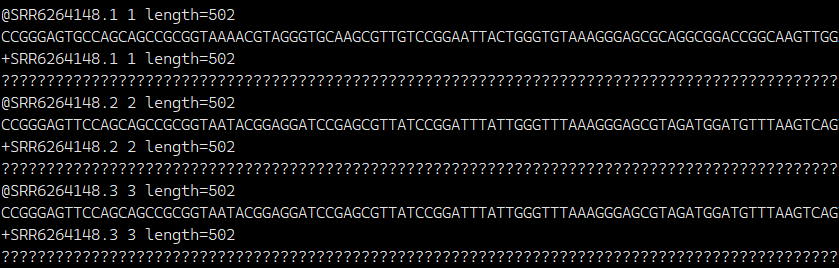
</p>

**sralite fq fastp result**

<p align="center">
  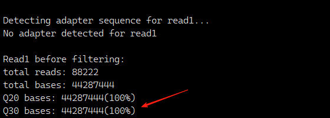
</p>

>Illumina fastq and sam/bam specifications support a quality bit that is set by the sequencing instrument and SRA Lite stores this as a "pass"/"reject" Read_Filter value. If this bit is set in the submitted fastq or bam file, the value is retained. If it is not, SRA will set a pass/reject value based on the quality score distribution within each read. Reads that have more than half of quality score values <20 are flagged "reject". Reads that begin or end with a run of more than 10 quality scores <20 are also flagged "reject". Reads that pass these quality checks are flagged "pass". When dumping data using the fastq-dump, fasterq-dump, or sam-dump utilities in the SRA toolkit, all reads are included by default. However, the fastq-dump tool has an option to include only passed or only rejected reads:

```fastq-dump --read-filter <[pass|reject]>```

***dada2 dose not work with this kind of data without the real qualities.*** Specially in the step learnError, it causes error.
<p align="center">
  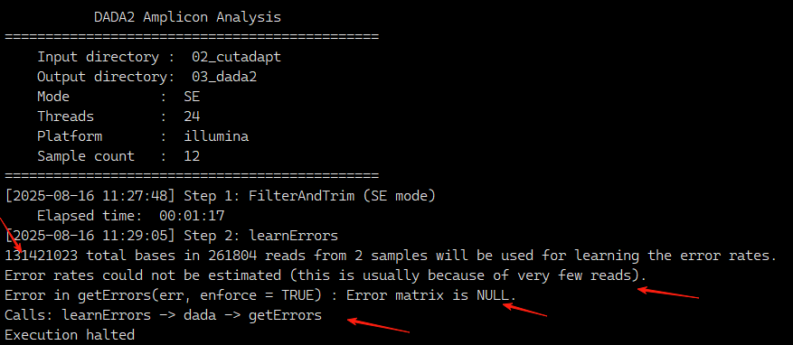
</p>


### Step 4: Organizing FASTQ by BioProject
```bash
fq_dispatcher.py --metadata 02_batch.SRA_Accessions.tab.live.run.public.add_experiment.amplicon.metagenomics.16s --fq-dir fq --threads 4 --header --out-root PROCESSING
```
***all fq files were moved the corresponding folder***
<p align="center">
  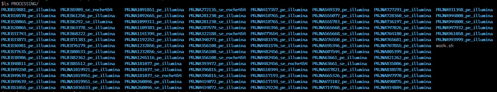
</p>


***projectAcc_pe_illumina*** 

```se``` refers to the ```--mode PE --r1_suffix .fastq```

```pe``` refers to the ```--mode PE --r1_suffix _1.fastq --r2_suffix _2.fastq```

 ```illumina``` refers to ```--platform illumina```

 ```roche454```refers to ```--platform 454```

> Pitfalls

***projectAcc_pe_roche454*** Not ```pe``` conflicts with ```roche 454```, these data must be 


### Step 5: run dd2_pipeline.sh 

```text
1. 📄 seqkit  -> seqkit.stat.tsv
2. ✂️ fastp   -> fastp.filter.tsv
3. ✂️ cutadapt -> cutadapt_details.tsv + cutadapt.summary.tsv
4. 🧬 DADA2 (PE | SE) (illumina|roche454|iontorrent)  
4.1 if dada2 pe modes, 25% samples lost half reads, re-dada2 in SE mode -> reads_lost_ratio.tsv + reads_lost_ratio.summary.tsv - 03_dada2/dada2_filtered(rm)
4.2 finished -> seqtab.nochim.rds + track.summary.tsv
5. 🧹 cleanup  00_fq 01_fastp 02_cutadapt
```


#### **parallel using tmux [tmux](https://www.howtogeek.com/671422/how-to-use-tmux-on-linux-and-why-its-better-than-screen/)**
```bash
# PE
cd PROCESSING
ls -d */ | grep 'pe_illumina' > pe_illumina_jobs

tmux new -s jobs1_20
conda activate dada2
cd PROCESSING/
sed -n '1,20p' pe_illumina_jobs | while read a;do echo ${a} && cd ${a} && dd2_pipeline.sh --input_dir 00_fq --r1_suffix .fastq.gz --threads 20 --mode SE --platform illumina && cd -;done

tmux new -s jobs21_40
sed -n '21,40p' pe_illumina_jobs | while read a;do echo ${a} && cd ${a} && dd2_pipeline.sh --input_dir 00_fq --r1_suffix .fastq.gz --threads 20 --mode SE --platform illumina && cd -;done


# for SE
# # find PE reads, not finished project
ls -d */ | grep 'se_illumina' > se_illumina_jobs 
cat se_illumina_jobs | while read a;do echo ${a} && cd ${a} && dd2_pipeline.sh --input_dir 00_fq --r1_suffix .fastq.gz --threads 20 --mode SE --platform illumina && cd -;done
```

***dada2 is the most time consuming step, low cpu efficiency, even you set it to 24, 16-24 enough***
<p align="center">
  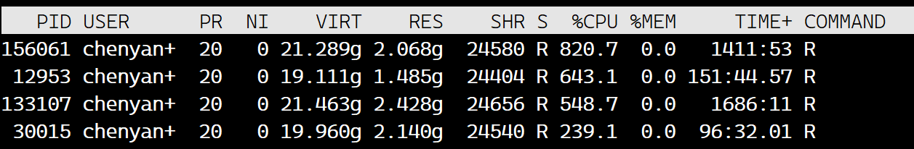
</p>

***using tmux to open multiple consoles***

<p align="center">
  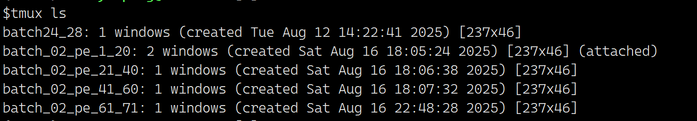
</p>

#### Running in slurm 
```bash
#!/bin/bash
#SBATCH --job-name=dd2          # job name
#SBATCH --partition=cn          # parttion name
#SBATCH --output=/dev/null      # stdout log
#SBATCH --error=/dev/null       # stderr log
#SBATCH --array=1-24%5          # 1000 tasks per 10 at once
#SBATCH --cpus-per-task=12      # 12 cpu for each task
#SBATCH --mem=500G              # 500 GB per task
#SBATCH --time=10-00:00:00      # 10 days

source /home/software/miniconda3/etc/profile.d/conda.sh
conda activate dada2

HOME_DIR="/home/chenyanpeng/project/pacearchaeales.20250408/24_ncbi_amplicon/57.download.finished.project.fq"
cd "${HOME_DIR}"

PROJECT_DIR=$(ls */ -d | sed -n "${SLURM_ARRAY_TASK_ID}p")
BASENAME=$(basename "${PROJECT_DIR}")

# redirect std out and std err to specidied log
exec > "${BASENAME}_${SLURM_ARRAY_JOB_ID}_${SLURM_ARRAY_TASK_ID}.log" 2>&1

cd "${PROJECT_DIR}"
echo "##### ${BASENAME}"
echo "pwd: $(pwd)"

INPUT_DIR="00_fq"
MODE=""
PLATFORM=""
R1_SUFFIX=""
R2_SUFFIX=""
THREADS=12

if [[ "$BASENAME" == *pe_illumina* || "$BASENAME" == *pe_bgi* ]]; then
  MODE="PE"
  PLATFORM="illumina"
  R1_SUFFIX="_1.fastq.gz"
  R2_SUFFIX="_2.fastq.gz"
elif [[ "$BASENAME" == *se_illumina* || "$BASENAME" == *se_bgi* ]]; then
  MODE="SE"
  PLATFORM="illumina"
  R1_SUFFIX=".fastq.gz"
elif [[ "$BASENAME" == *se_roche454* ]]; then
  MODE="SE"
  PLATFORM="454"
  R1_SUFFIX=".fastq.gz"
elif [[ "$BASENAME" == *se_iontorrent* ]]; then
  MODE="SE"
  PLATFORM="iontorrent"
  R1_SUFFIX=".fastq.gz"
else
  echo "ERROR: unknown $BASENAME"
  echo "only match：*pe_illumina* | *pe_bgi* | *se_illumina* | *se_roche | *se_iontorrent*"
  exit 3
fi

echo "start：dd2_pipeline.sh \\"
echo "  --input_dir ${INPUT_DIR} \\"
echo "  --threads ${THREADS} \\"
echo "  --mode ${MODE} \\"
echo "  --platform ${PLATFORM} \\"
if [[ "$MODE" == "PE" ]]; then
  echo "  --r1_suffix ${R1_SUFFIX} \\"
  echo "  --r2_suffix ${R2_SUFFIX}"
else
  echo "  --r1_suffix ${R1_SUFFIX}"
fi

# ---- running ----
if [[ "$MODE" == "PE" ]]; then
  dd2_pipeline.sh \
    --input_dir "$INPUT_DIR" \
    --r1_suffix "$R1_SUFFIX" \
    --r2_suffix "$R2_SUFFIX" \
    --threads "$THREADS" \
    --mode "$MODE" \
    --platform "$PLATFORM"
else
  dd2_pipeline.sh \
    --input_dir "$INPUT_DIR" \
    --r1_suffix "$R1_SUFFIX" \
    --threads "$THREADS" \
    --mode "$MODE" \
    --platform "$PLATFORM"
fi

```


### Results

***Finished bioproject***
<p align="center">
  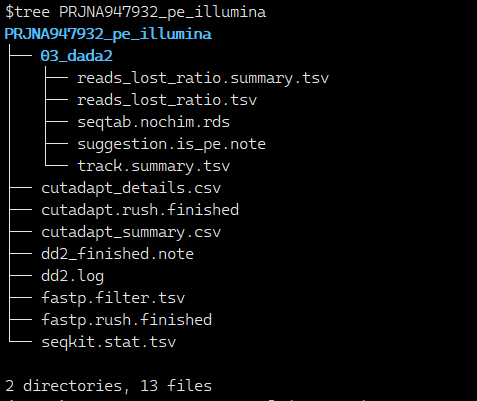
</p>

```reads_lost_ratio.summary.tsv``` summary of primer use

<p align="center">
  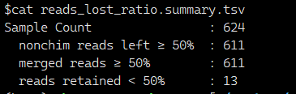
</p>

```reads_lost_ratio.tsv``` how many reads left after dada2 analysis
<p align="center">
  
</p>

```seqkit_stat.tsv``` fq statistics
<p align="center">
  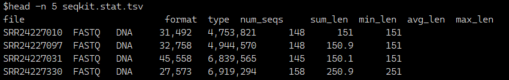
</p>

```seqtab.nochim.rds``` the main results, asv count matrix

```suggestion.is_pe.note``` Label file, pe data, of 75% samples have more than half reads left.

```track.summary.tsv``` reads number changes.
<p align="center">
  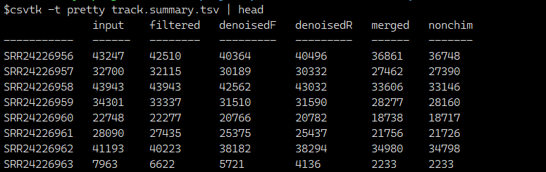
</p>


***Pitfalls***

1. SRA was split into 3 fq files: ```accession_1.fastq.gz```, ```accession_2.fastq.gz```, ```accession.fastq.gz``` 
```text
target_project/accession_1.fastq.gz 
target_project/accession_1.fastq.gz 
fq/accession.fastq.gz  # remove it
```
```bash
# remove the 3rd fastq or ignore them
find fq -maxdepth 1 -type f -name '*.fastq.gz' ! -name '*_[12].fastq.gz' | sed 's/.fastq.gz//' |rush -j 50 --continue --eta -v FQ=fq -v PDIR=PAIRED 'if find {PDIR} -type f \( -name "{1}_1.fastq" -o -name "{1}_1.fastq.gz" \) -print -quit | grep -q .; then rm "{FQ}/{1}.fastq.gz" 2>/dev/null;fi'
```

2. Single-end reads were marked as PAIRED in metadata. Don't worry. We did not use the metadata to capture the layout, we get this info from fq files. PE if the accession has _1.fastq(.gz) _2.fastq(.gz)

---

## Common Pitfalls
- **Shell globbing**: Always quote patterns; escape parentheses in `find` (`\(`, `\)`).
- **Mixed read types**: Do not mix PE and SE in a single BioProject directory.
- **Oversized runs**: Amplicon runs >1 GB likely misannotated — verify before processing.
- **SRA locks**: Remove stale `.sra.lock` files if `prefetch` aborts (ensure no process is running).

---

## Troubleshooting

### 1) Is this truly 16S amplicon data?
```bash
is_16s_amplicon.sh -i in.fq -t 16
```
```
$ is_16s_amplicon.sh --input ERR6876596.fastq.gz --threads 12
sample_id            bac_hits   arch_hits  total_hits   total_percent   is_16S
ERR6876596.fastq.gz  1000       0          1000         100.0           YES
```

### 2) Were paired-end reads merged well?
Check `track.summary.tsv` after DADA2: counts for `filtered`, `merged`, `nonchim`. If retained reads < 50% of input, try **SE analysis using forward reads only**.

```bash
# scripts/amplicon_reads_lost_check.sh
amplicon_reads_lost_check.sh -i track.summary.tsv -o reads_lost_ratio.details.tsv
```

```
$ cat reads_lost_ratio.summary.tsv
Sample Count                : 502
  nonchim reads left ≥ 50%  : 125
  merged reads ≥ 50%        : 130
  reads retained < 50%      : 372

⚠️  Suggestion: More than 25% of samples have low merged and nonchim rates. Switch to SE analysis may improve results.
```

---

## Notes
- **Batching** improves stability on large cohorts; reruns can target failed batches only.
- **Resource tuning**: Align `-j/--threads` with available CPU/IO bandwidth.
