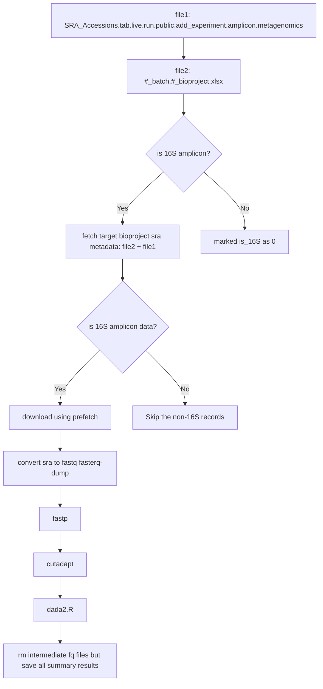

# ProkaAtlas 

A comprehensive pipeline for processing 16S rRNA gene amplicon data, including DADA2 tables, scripts, and results.

---

## Table of Contents

- [Software Dependencies](#software-dependencies)
- [Reference Data](#reference-data)
- [Command-line Workflow](#command-line-workflow)
    - [1. Select SRA Records](#1-select-sra-records-by-bioproject-accession)
    - [2. Exclude Non-16S Records & Download](#2-exclude-non-16s-sra-records-and-download)
    - [3. Convert SRA to FASTQ](#3-convert-sra-to-fastq)
    - [4. Downstream Processing](#4-downstream-processing-with-in-house-pipeline)
- [Work List](#work-list)

---

## Software Dependencies

| Software  | Version  | Purpose                                      |
|-----------|----------|----------------------------------------------|
|  | 3.1.1    | Download SRA data and split into FASTQ files |
|            | 0.24.0   | Quality control of FASTQ files               |
|        | 5.1      | Primer detection and trimming                |
|  | ≥3.9     | Run Python scripts                           |
|               | 4.4.3    | Run R packages                               |
|      | 2.10.0   | FASTQ file statistics                        |
|           | 0.6.1    | Parallel task execution                      |
|        | 0.33.0   | Table filtering                              |

### R Package Dependencies

| Package | Version | Purpose                           |
|---------|---------|-----------------------------------|
|  | 1.34.0  | Amplicon sequence analysis        |
| getopt  |         | Command-line argument parsing     |

---

## Reference Data

To build a 16S rRNA gene reference database for verifying FASTQ data:

```bash
wget -c https://ftp.ncbi.nlm.nih.gov/refseq/TargetedLoci/Archaea/archaea.16SrRNA.fna.gz
wget -c https://ftp.ncbi.nlm.nih.gov/refseq/TargetedLoci/Bacteria/bacteria.16SrRNA.fna.gz
gunzip *.gz
cat archaea.16SrRNA.fna | awk '{print $1}' | sed 's/>/>archaea__/' > arch_bac_nr_16s_ref.fna
makeblastdb -in arch_bac_nr_16s_ref.fna -input_type fasta -db_type nucl -out arch_bac_nr_16s_ref
is_16s_amplicon.sh -i in.fq -t 16 
```

---

## Command-line Workflow
# My Project

## Workflow Diagram



### 1. Select SRA Records by BioProject Accession

```bash
csvtk grep -t -f BioProject --pattern-file 02_batch.bioproject.list SRA_Accessions.tab.live.run.public.add_experiment.amplicon.metagenomics > 02_batch.bioplicon.metagenomics
```

---

### 2. Exclude Non-16S SRA Records and Download

```bash
grep -i -v -e '_ITS2' -e 'ITS1 ' -e 'Fungal ITS' -e '_ITS_' -e '18S_NCOG' -e "18SV" -e '18S V9 amplification' -e 'COI region' -e 'COI amplification' -e '_Fi' -e '18S rDNA' -e 'cpn60 gene' -e 'ITS region' -e ' ITS1' -e '18S V4' -e '18S rRNA' -e 'ITS_000000000' 02_batch.bioproject.list.amplicon.metagenomics | sed '1d' | awk -F '\t' '{print $2"\t"$19}' > sra2bioproject.list
cat sra2bioproject.list | awk -F '\t' '{print $1}' | rush -j 48 --continue --eta --succ-cmd-file 02_batch.bioproject.rush_prefetch.finished 'prefetch {} -O 02_batch/sra &> prefetch.log'
```

---

### 3. Convert SRA to FASTQ

Verify all records are downloaded:

```bash
cat sra2bioproject.list | awk -F '\t' '{print $1}' | wc -l
wc -l 02_batch.bioproject.rush_prefetch.finished
```

Split SRA files into FASTQ:

```bash
cat sra2bioproject.list | awk -F '\t' '{print $1}' | rush -j 48 --continue --eta --succ-cmd-file 02_batch.bioproject.rush_faterq_dump.finished 'fasterq-dump --threads 1 {} -O 02_batch/sra'
```

Remove SRA files and their parent directories (use with caution):

```bash
cat sra2bioproject.list | awk -F '\t' '{print $1}' | rush -j 48 'rm -rf 02_batch/sra/{}'
```

> **Note:**  
> Some projects contain both paired-end and single-end reads. Split these into separate BioProjects (e.g., `bioproject`, `bioproject_2`). If sequencing platforms differ, split again.

---

### 4. Downstream Processing with In-house Pipeline

Use the provided shell script to run `seqkit`, `fastp`, `cutadapt`, and `dada2` (supports SLURM):

**Paired-end reads:**  
```bash
bash dd2_pipeline.sh --input_dir 00_fq \
        --r1_suffix _1.fastq --r2_suffix _2.fastq \
        --threads 48 \
        --mode PE \
        --platform illumina
```

**Single-end reads:**  
```bash
bash dd2_pipeline.sh --input_dir 00_fq \
        --r1_suffix _1.fastq \
        --threads 48 \
        --mode SE \
        --platform illumina
```

---

## Work List

- chen: project 1-200 `in progress` 
- chen: check metadata `in progress` 

---

