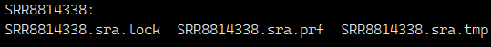

<p align="center">
  
</p>

<h1 align="center">5M16S</h1>

<p align="center">
  <a href="https://github.com/yourusername/5M16S">
    
  </a>
  <a href="https://github.com/yourusername/5M16S">
    
  </a>
  
  
</p>

<p align="center"><i>
An end-to-end pipeline for 16S rRNA gene amplicon analysis — from raw SRA accessions to DADA2 ASV tables, with reproducible scripts, references, and troubleshooting.
</i></p>

> [!WARNING]
> 🚧 Project under active development — features and docs may change.

---

## 📑 Table of Contents
<details>
<summary><b>Expand / Collapse</b></summary>


- [Key Challenges](#key-challenges)
- [Software Requirements](#software-requirements)
- [Scripts](#scripts)
- [Reference Data](#reference-data)
- [Workflow](#workflow)
  - [Step 0. Global 16S rRNA gene SRA metadata](#00-obtain-global-16s-sra-candidates)
  - [Step 1: Data cleaning](#step-1-select-sra-records-by-bioproject)
  - [Step 2: Downloading](#step-2-download-with-prefetch)
  - [Step 3: Converting SRA → FASTQ](#step-3-convert-sra--fastq)
  - [Step 4: Organize FASTQs by BioProject, Layout & Platform
](#step-4-arrange-fastq-by-bioproject)
  - [Step 5: dada2 Analysis by BioProject Directory
](#step-5-run-dada2-per-bioproject)
  - [Step 6: 16S rRNA gene sequencing Region Identification
](#step-5-run-dada2-per-bioproject)
  - [Step 7: Merging by 16S rRNA gene regions
](#step-5-run-dada2-per-bioproject)
  - [Step 8: Removing non-16S rRNA gene features
](#step-5-run-dada2-per-bioproject)
  - [Step 9: Checking sequencing saturation & Removing Unsaturated Data
](#step-5-run-dada2-per-bioproject)
  - [Step 10: Ontology assignments
](#step-5-run-dada2-per-bioproject)
  - [Step 11: Ontology assignments
](#step-5-run-dada2-per-bioproject)
  - [Step 12: Mapping Geographic Coordinates
](#step-5-run-dada2-per-bioproject)


- [Common Pitfalls](#common-pitfalls)
- [Troubleshooting](#troubleshooting)
- [Notes](#notes)

</details>

---

## 🚧 Key Challenges
1. **Comprehensive Retrieval** – Capturing all available 16S amplicon datasets.
2. **Platform Diversity** – Handling Roche 454 | Illumina | Ion Torrent | PacBio.
3. **Primer Strategy** – Whether, when, and how to trim primers.
4. **Target Regions** – Managing different 16S variable regions.
5. **Ecology/Metadata** – Heterogeneous ecological metadata.
6. **Quality Thresholds** – Consistent, defensible QC criteria.

---

## 🛠 Software Requirements

| Software  | Version  | Purpose |
|-----------|----------|---------|
|  | 3.1.1 | Retrieve and split SRA data into FASTQ |
|  | 0.24.0 | FASTQ quality control and filtering |
|  | 5.1 | Primer detection and trimming |
|  | ≥3.9 | Run Python utilities |
|  | 4.4.3 | Run R-based analysis |
|  | 2.10.0 | FASTQ statistics |
|  | 0.6.1 | Parallel execution |
|  | 0.33.0 | Table filtering and manipulation |


| Package | Version | Purpose |
|---------|---------|---------|
|  | 1.34.0 | Amplicon sequence variant inference |
|   | — | Command-line argument parsing |

---
## Scripts

| Script                      | Required | Language | Status      | Purpose |
|----------------------------|:--------:|:--------:|------------|---------|
| `amplicon_reads_lost_check.sh` | ✅ | Shell    | Stable     | Check the **ratio of reads lost after merging**; reports samples with low merged/non-chimera retention. |
| `dada2.R`                  | ✅       | R        | Stable     | **Wrapper for DADA2** to infer ASVs and produce QC summaries. |
| `dd2_pipeline.sh`          | ✅       | Shell    | Stable     | **Main pipeline driver**: orchestrates `seqkit → fastp → cutadapt → DADA2` (PE/SE). |
| `fq_sorter.py`             | ✅       | Python   | Stable     | **Arrange downloaded FASTQ files by metadata** (e.g., BioProject, platform, PE/SE) into `PROJECT/00_fq/`. |
| `is_16S_amplicon.sh`       | —        | Shell    | Stable     | **Verify whether data were generated from 16S rRNA amplicon sequencing** (e.g., via reference hits). |
| `merge_seqtab_nochim_rds.R`| —        | R        | Developing | **Merge DADA2 `seqtab_nochim` RDS files** across runs/projects. |
| `ontology_infer.py`        | —        | Python   | Developing | **Ontology inference** utilities for downstream metadata/label prediction. |
| `ontology_train_cv.py`     | —        | Python   | Developing | **Ontology training & cross-validation** helpers. |
| `split_fq12.sh`            | —        | Shell    | Stable     | **Split concatenated paired-end reads** into `_1` and `_2` files. |
| `summarize_cutadapt.py`    | ✅       | Python   | Stable     | **Summarize cutadapt results** (primer detection/trim statistics). |
| `unify_fq_suffix.py`       | —        | Python   | Stable     | **Normalize FASTQ filenames**, especially for non-NCBI data sources. |

> **Note:** Ensure all scripts marked **✅ Required** are **installed and executable** before running the pipeline.


## Reference Data
Build a 16S rRNA reference database for verifying FASTQ content (optional but recommended).

```bash
# Download archaeal & bacterial 16S rRNA reference sequences
wget -c https://ftp.ncbi.nlm.nih.gov/refseq/TargetedLoci/Archaea/archaea.16SrRNA.fna.gz
wget -c https://ftp.ncbi.nlm.nih.gov/refseq/TargetedLoci/Bacteria/bacteria.16SrRNA.fna.gz
gunzip *.gz

# Example: normalize headers and build BLAST DB
cat archaea.16SrRNA.fna | awk '{print $1}' | sed 's/>/>archaea__/' > arch_bac_nr_16s_ref.fna
makeblastdb -in arch_bac_nr_16s_ref.fna -input_type fasta -db_type nucl -out arch_bac_nr_16s_ref
```

---

## Workflow

### 00. Obtain Global 16S SRA Candidates
Fetch metadata snapshots and derive a working set of public, live RUN accessions likely to be amplicons.

```bash
# All accessions (master table)
wget -c https://ftp.ncbi.nlm.nih.gov/sra/reports/Metadata/SRA_Accessions.tab

# Full metadata (one submission per folder)
wget -c https://ftp.ncbi.nlm.nih.gov/sra/reports/Metadata/NCBI_SRA_Metadata_Full_20250619.tar.gz

tar -zxvf NCBI_SRA_Metadata_Full_20250619.tar.gz

# Keep public, live RUN entries with a BioProject
head -n 1 SRA_Accessions.tab > SRA_Accessions.tab.live.run.public
sed '1d' SRA_Accessions.tab | awk -F '\t' '$3 ~ "live" && $7 ~ "RUN" && $19 !~ "-" && $9 ~ "public" {print}' >> SRA_Accessions.tab.live.run.public

# One submission may contain multiple runs/experiments; not all XMLs may exist
cat SRA_Accessions.tab.live.run.public | awk '{print $2}' | sed '1d' | sort -u > SRA_Accessions.tab.live.run.public.submission_acc.uniq

# Extract experiment info from XMLs
python3 extract_experiment_info.py -o submission.accession.unique.experiment.tsv -t 24 NCBI_SRA_Metadata_Full_20250619

# Merge tables in R
Rscript merge_table.R SRA_Accessions.tab.live.run.public submission.accession.unique.experiment.tsv SRA_Accessions.tab.live.run.public.add_experiment 24

# Keep likely amplicon libraries (strategy/source)
cat SRA_Accessions.tab.live.run.public.add_experiment | \
  csvtk -t filter2 -j 8 -f '$lib_strategy == "AMPLICON" && ($lib_source == "METAGENOMIC" || $lib_source == "GENOMIC" || $lib_source == "OTHER")' \
  > SRA_Accessions.tab.live.run.public.add_experiment.amplicon

# Heuristic filter to keep 16S (allow mismatches/missing)
head -n 1 SRA_Accessions.tab.live.run.public.add_experiment.amplicon.metagenomics > SRA_Accessions.tab.live.run.public.add_experiment.amplicon.metagenomics.16s
cat non_16s_keywords.list | grep -f - SRA_Accessions.tab.live.run.public.add_experiment.amplicon.metagenomics > SRA_Accessions.tab.live.run.public.add_experiment.amplicon.metagenomics.non16s
cat non_16s_keywords.list | grep -v -f - SRA_Accessions.tab.live.run.public.add_experiment.amplicon.metagenomics >> SRA_Accessions.tab.live.run.public.add_experiment.amplicon.metagenomics.16s
# recover possible 16S
grep -i '16s' SRA_Accessions.tab.live.run.public.add_experiment.amplicon.metagenomics.non16s >> SRA_Accessions.tab.live.run.public.add_experiment.amplicon.metagenomics.16s
```

> **File:** `SRA_Accessions.tab.live.run.public.add_experiment.amplicon.metagenomics.16s` *(mismatches/missing possible)*

### Batching Strategy
> For large projects, split into batches to improve throughput and resilience.

```
02_batch.bioproject.list   # BioProject accessions, one per line
```

### Step 1: Select SRA Records by BioProject
*Treat the 16S candidate table as the lake; BioProject accessions are your baits.*

```bash
# Using csvtk
csvtk grep -t -f BioProject --pattern-file 02_batch.bioproject.list \
  SRA_Accessions.tab.live.run.public.add_experiment.amplicon.metagenomics.16s \
  > 02_batch.SRA_Accessions.tab.live.run.public.add_experiment.amplicon.metagenomics.16s

# Or use grep
head -n 1 SRA_Accessions.tab.live.run.public.add_experiment.amplicon.metagenomics \
  > 02_batch.bioplicon.metagenomics  # redirect header line 

cat 02_batch.bioproject.list | grep -F -w -f - \
  SRA_Accessions.tab.live.run.public.add_experiment.amplicon.metagenomics.16s \
  >> 02_batch.SRA_Accessions.tab.live.run.public.add_experiment.amplicon.metagenomics.16s
```

> **Tip:** add more specific filters to exclude non‑16S records.

### Step 2: Download with prefetch
*Adjust concurrency based on your network. Too many threads can waste CPU; too few underuse bandwidth.*

```bash
# If an amplicon run is >1 GB, double‑check its identity — often not true amplicon data.
# $2 = SRA run accession
cat 02_batch.SRA_Accessions.tab.live.run.public.add_experiment.amplicon.metagenomics.16s \
  | awk -F '\t' '{print $2}' \
  | rush -j 24 --continue --eta --succ-cmd-file rush_prefetch.finished \
      'prefetch {1} -O sra &> /dev/null'

# if downloading was interrupted, continue, removed the locked accessions
find sra -maxdepth 2 -name "*.sra.lock" -type f -exec dirname {} \; | xargs -n1 -I {} rm -rf {}

# and continue again, rush will check the finished file: rush_prefetch.finished, and skip finished ones
cat 02_batch.SRA_Accessions.tab.live.run.public.add_experiment.amplicon.metagenomics.16s \
  | awk -F '\t' '{print $2}' \
  | rush -j 24 --continue --eta --succ-cmd-file rush_prefetch.finished \
      'prefetch {1} -O sra &> /dev/null'

# -- or
ls sra | grep -w -v -F -f - 02_batch.SRA_Accessions.tab.live.run.public.add_experiment.amplicon.metagenomics.16s | awk -F '\t' '{print $2}' \
  | rush -j 24 --eta \
      'prefetch {1} -O sra &> /dev/null'
```



### Step 3: Convert SRA → FASTQ

```bash
mkdir -p fq
# Split and delete SRA to save space
awk -F '\t' 'NR>1{print $2}' 02_batch.SRA_Accessions.tab.live.run.public.add_experiment.amplicon.metagenomics.16s \
  | rush -j 48 --continue --eta --succ-cmd-file rush_fastq_dump.finished \
    'fastq-dump --threads 1 --split-3 --outdir fq sra/{1}/{1}.sra &>/dev/null && rm -rf sra/{1}'

# If any failed, try again without redirecting logs
awk -F '\t' 'NR>1{print $2}' 02_batch.SRA_Accessions.tab.live.run.public.add_experiment.amplicon.metagenomics.16s \
  | rush -j 48 --continue --eta --succ-cmd-file rush_fastq_dump.finished \
    'fastq-dump sra/{1}/{1}.sra --threads 1 --split-3 --outdir fq'

# Or gzip on the fly, then remove SRA
awk -F '\t' 'NR>1{print $2}' 02_batch.SRA_Accessions.tab.live.run.public.add_experiment.amplicon.metagenomics.16s \
  | rush -j 48 --continue --eta --succ-cmd-file rush_fastq_dump.finished \
    'fastq-dump --threads 1 --split-3 --outdir fq --gzip sra/{1}/{1}.sra && rm -rf sra/{1}'
# a small proporation of downloaded data were sralite
find sra -maxdepth 2 -name '*.sralite' -exec basename {} _\;| 
# Remove empty sra dir if any
rmdir sra || true
```


### Step 4: Arrange FASTQ by BioProject
*move fq files to their bioproject/00_fq folders as the following:*
all *fastq.gz in 00_fq
- pe.reads is a label file represents all reads are PE sequencing
- se.reads SE sequencing
- pe_se.reads mixed， if count_pe_sample ~= count_se_sample, split to pe and se first, and dd2_pipeline,sh
- sra_3_fq.note means some sra were split into 3 fq files, _1.fastq.gz,_2.fastq.gz,fastq.gz. the last one were move into folder sra_3_fq, these files are not be used in dd2_pipeline.sh


```bash
fq_sorter.py --metadata 02_batch.SRA_Accessions.tab.live.run.public.add_experiment.amplicon.metagenomics.16s --fq-dir fq --threads 4 --header --out-root PROCESSING

ls PROCESSING
```
```text
# folder arrangement
 PRJEB51055_pe_illumina   PRJNA1019921_pe_illumina  PRJNA1263551_se_illumina  PRJNA445346_se_illumina
 PRJEB51055_se_illumina   PRJNA1019921_se_illumina  PRJNA181037_pe_illumina   PRJNA287579_pe_illumina
 PRJNA272135_pe_roche454  PRJNA1019951_pe_illumina  PRJNA181037_se_illumina   PRJNA450937_pe_illumina
 PRJEB5989_pe_roche454    PRJNA1019951_se_illumina  PRJNA181037_se_roche454   PRJNA450937_se_illumina
```
>Note

***projectAcc_pe_illumina*** 

```se``` refers to the ```--mode PE --r1_suffix .fastq```

```pe``` refers to the ```--mode PE --r1_suffix _1.fastq --r2_suffix _2.fastq```

 ```illumina``` refers to ```--platform illumina```

 ```roche454```refers to ```--platform 454```

> Pitfalls

***projectAcc_pe_roche454*** Not ```pe``` conflicts with ```roche 454```, these data must be 


### Step 5: run dd2_pipeline.sh 

```text
📄 seqkit  ➡️  ✂️ fastp  ➡️  ✂️ cutadapt  ➡️  🧬 DADA2 (PE | SE)  

                                               ⬇️ low merged ratio  
                                               🧬 DADA2 (SE)  
                                               ⬇️  
🧹 cleanup  ➡️  ✅ done
```
```bash
# PE
cd PROCESSING
ls -d */ | grep 'pe_illumina' | while read a;do echo ${a} && cd ${a} && dd2_pipeline.sh --input_dir 00_fq --r1_suffix .fastq.gz --threads 40 --mode SE --platform illumina && cd -;done

# for SE
# # find PE reads, not finished project
ls -d */ | grep 'se_illumina' | while read a;do echo ${a} && cd ${a} && dd2_pipeline.sh --input_dir 00_fq --r1_suffix .fastq.gz --threads 40 --mode SE --platform illumina && cd -;done

# for PE SE mixed project
# check and manually
```


***Pitfalls***

1. SRA was split into 3 fq files: ```accession_1.fastq.gz```, ```accession_2.fastq.gz```, ```accession.fastq.gz``` 
```text
target_project/accession_1.fastq.gz 
target_project/accession_1.fastq.gz 
fq/accession.fastq.gz  # remove it
```
```bash
# remove the 3rd fastq
find fq -maxdepth 1 -type f -name '*.fastq.gz' ! -name '*_[12].fastq.gz' | sed 's/.fastq.gz//' |rush -j 50 --continue --eta -v FQ=fq -v PDIR=PAIRED 'if find {PDIR} -type f \( -name "{1}_1.fastq" -o -name "{1}_1.fastq.gz" \) -print -quit | grep -q .; then rm "{FQ}/{1}.fastq.gz" 2>/dev/null;fi'
```
3. Single-end reads were marked as PAIRED in metadata
```bash
# if some fq files are not moved in fq. Check them 


# 1 sometimes, sra will be split into 3 files
# if the left fq files is the third fq for PE reads, remove it, like


# 2 sometimes, some fq files are not moved properly, please check the metadata and move thme manually

```

---

## Common Pitfalls
- **Shell globbing**: Always quote patterns; escape parentheses in `find` (`\(`, `\)`).
- **Mixed read types**: Do not mix PE and SE in a single BioProject directory.
- **Oversized runs**: Amplicon runs >1 GB likely misannotated — verify before processing.
- **SRA locks**: Remove stale `.sra.lock` files if `prefetch` aborts (ensure no process is running).

---

## Troubleshooting

### 1) Is this truly 16S amplicon data?
```bash
is_16s_amplicon.sh -i in.fq -t 16
```
```
$ is_16s_amplicon.sh --input ERR6876596.fastq.gz --threads 12
sample_id            bac_hits   arch_hits  total_hits   total_percent   is_16S
ERR6876596.fastq.gz  1000       0          1000         100.0           YES
```

### 2) Were paired-end reads merged well?
Check `track.summary.tsv` after DADA2: counts for `filtered`, `merged`, `nonchim`. If retained reads < 50% of input, try **SE analysis using forward reads only**.

```bash
# scripts/amplicon_reads_lost_check.sh
amplicon_reads_lost_check.sh -i track.summary.tsv -o reads_lost_ratio.details.tsv
```

```
$ cat reads_lost_ratio.summary.tsv
Sample Count                : 502
  nonchim reads left ≥ 50%  : 125
  merged reads ≥ 50%        : 130
  reads retained < 50%      : 372

⚠️  Suggestion: More than 25% of samples have low merged and nonchim rates. Switch to SE analysis may improve results.
```

---

## Notes
- **Batching** improves stability on large cohorts; reruns can target failed batches only.
- **Resource tuning**: Align `-j/--threads` with available CPU/IO bandwidth.
- **Reproducibility**: Pin software versions; export conda envs / R session info.

---

📌 *Built for scalability, reproducibility, and cross‑platform flexibility.*